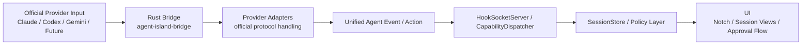

# Multi-Agent Architecture

Related docs:

- [Docs Index](./README.md)
- [Unified Agent Protocol v1](./unified-agent-protocol.md)
- [Runtime Observability](./runtime-observability.md)
- [Agent Extension Guide](./agent-extension-guide.md)

## Goal

AgentIsland should treat Claude, Codex, Gemini, and future providers as integrations on top of one shared runtime, not as separate product implementations.

Current implementation note:

- provider-specific hook differences are handled in adapters
- UI, state-machine, and approval flows converge on [Unified Agent Protocol v1](./unified-agent-protocol.md)
- compatibility details stay in the ingress and adapter boundary, not in product-facing runtime logic

## Runtime Diagram

## Design Principles

- Keep the product runtime provider-agnostic wherever possible.
- Isolate protocol differences at the adapter boundary.
- Model features as capabilities, not as hard-coded provider checks.
- Let unsupported capabilities be explicit instead of hidden in special cases.
- Prefer incremental replacement at the ingress boundary over product-layer branching.

## Runtime Layers

### 1. Provider Input

Raw data emitted by a specific provider:

- hook events
- transcript files
- runtime process metadata
- message transport handles

### 2. Ingress Engine

Receives external input and forwards it into the app runtime.

Current implementation:

- `AgentIsland/Services/Hooks/HookSocketServer.swift`

Responsibilities:

- socket lifecycle
- request/response channel handling
- ingest metadata preservation

### 3. Provider Adapters

Normalize provider-native payloads into shared semantics.

Current runtime adapters:

- `bridge-rs/src/adapter/claude.rs`
- `bridge-rs/src/adapter/codex.rs`
- `bridge-rs/src/adapter/gemini.rs`

Responsibilities:

- official event parsing
- unified event mapping
- provider response encoding
- downgrade diagnostics

### 4. Unified Runtime

The shared product state and policy core.

Current implementation centers on:

- `AgentIsland/Models/UnifiedAgentProtocol.swift`
- `AgentIsland/Services/Shared/CapabilityDispatcher.swift`
- `AgentIsland/Services/State/SessionStore.swift`

Responsibilities:

- session lifecycle
- tool state
- approval state
- conversation metadata
- runtime phase transitions

### 5. UI Layer

Everything user-visible or user-triggered:

- Notch state
- chat history rendering
- approval actions
- diagnostics settings

Key entry points:

- `AgentIsland/UI/Views/NotchView.swift`
- `AgentIsland/UI/Views/ChatView.swift`
- `AgentIsland/UI/Views/NotchMenuView.swift`

## Capability Model

Providers should declare what they support through capabilities, not through product-layer `if provider == ...` checks.

Minimum capability set:

- `permissions`
- `transcriptHistory`
- `runtimeObservation`
- `messaging`
- `toolTimeline`
- `subtasks`

## Current Product Rule

If a provider-specific feature does not affect shared runtime logic, keep it inside adapter-owned payload metadata instead of promoting it into the unified core.
