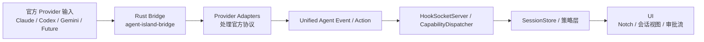

# 多 Agent 架构

相关文档：

- [文档索引](./README.zh.md)
- [统一 Agent 协议 v1](./unified-agent-protocol.zh.md)
- [运行时可观测性](./runtime-observability.zh.md)
- [Agent 扩展指南（中文）](./agent-extension-guide.zh.md)

## 目标

AgentIsland 应该把 Claude、Codex、Gemini 和未来 provider 看成同一套共享运行时上的集成，而不是彼此独立的产品实现。

当前实现说明：

- provider-specific hook 差异已经收敛到 adapter 层
- UI、状态机和审批流已经围绕 [统一 Agent 协议 v1](./unified-agent-protocol.zh.md)
- 兼容细节继续留在 ingress 和 adapter 边界，不再进入产品内核主叙事

## 运行时图示

## 设计原则

- 尽量让产品运行时保持 provider 无关。
- 把协议差异隔离在 adapter 边界。
- 用 capability 表达差异，而不是在产品层写死 provider 判断。
- 显式表达不支持的能力，而不是藏在特殊分支里。
- 优先在 ingress 边界做替换，不把特判放回产品层。

## 运行时分层

### 1. Provider 输入

由具体 provider 发出的原始数据：

- hook 事件
- transcript 文件
- 运行时进程元数据
- 消息传输句柄

### 2. 接入引擎

接收外部输入，并转发到应用运行时。

当前实现：

- `AgentIsland/Services/Hooks/HookSocketServer.swift`

职责：

- socket 生命周期
- 请求/响应通道处理
- ingress 元数据保留

### 3. Provider 适配器

把 provider 原生协议转换成共享语义。

当前运行时适配器：

- `bridge-rs/src/adapter/claude.rs`
- `bridge-rs/src/adapter/codex.rs`
- `bridge-rs/src/adapter/gemini.rs`

职责：

- 官方事件解析
- unified 事件映射
- provider 响应编码
- 降级诊断

### 4. 统一运行时

共享的产品状态与策略内核。

当前核心入口：

- `AgentIsland/Models/UnifiedAgentProtocol.swift`
- `AgentIsland/Services/Shared/CapabilityDispatcher.swift`
- `AgentIsland/Services/State/SessionStore.swift`

职责：

- 会话生命周期
- 工具状态
- 审批状态
- 会话元数据
- 运行时 phase 转换

### 5. UI 层

所有用户可见或由用户触发的部分：

- Notch 状态
- 聊天历史渲染
- 审批动作
- 诊断设置

关键入口：

- `AgentIsland/UI/Views/NotchView.swift`
- `AgentIsland/UI/Views/ChatView.swift`
- `AgentIsland/UI/Views/NotchMenuView.swift`

## Capability 模型

provider 应通过 capability 声明自己支持什么，而不是在产品层通过 `if provider == ...` 判断。

最低能力集合：

- `permissions`
- `transcriptHistory`
- `runtimeObservation`
- `messaging`
- `toolTimeline`
- `subtasks`

## 当前产品规则

如果某个 provider 特有能力不会影响共享运行时逻辑，就把它留在 adapter 自己的 payload metadata 里，而不是提升进 unified core。
